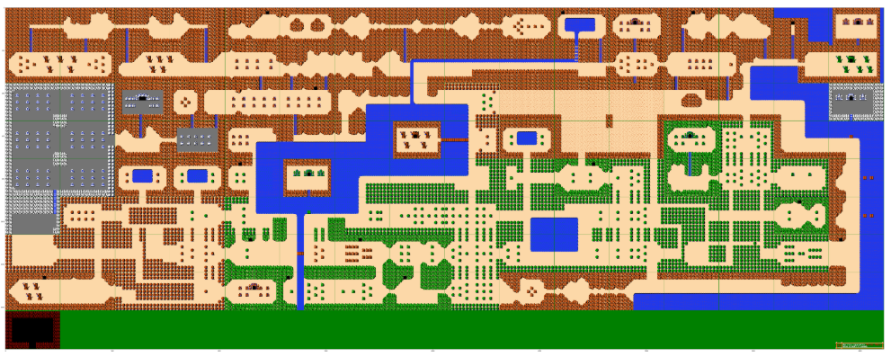
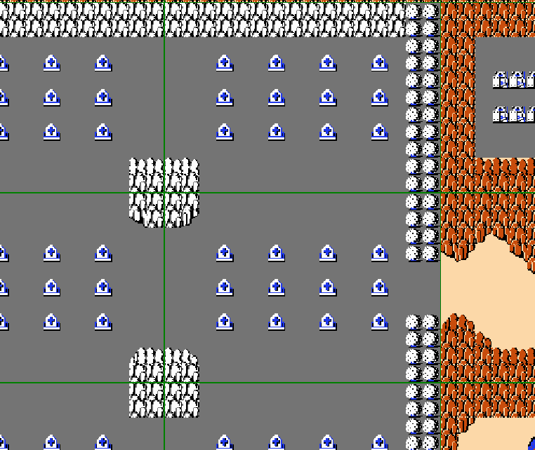
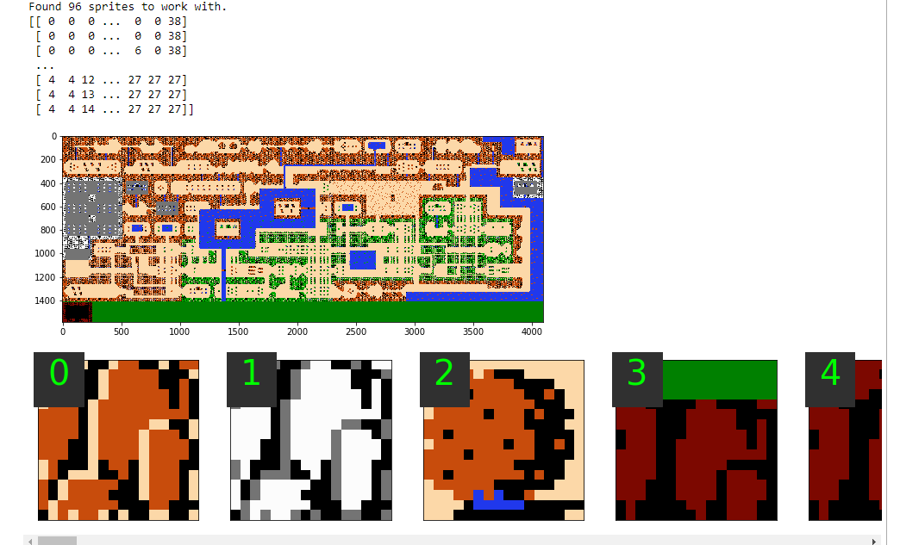

# sprite_sheet_sharder
Takes an image representing a world view of map consisting of repeating sprites.  Converts the map to a unique sprite sheet and a 2D array that maps the found sprites to their locations in the image.

#### Get me started fast:

1. You will need to have downloaded the world map that you want to process and have an available (ideally simple) path to the file.
2. You will need python version 3.x installed as well as the packages for Numpy, Pandas, and Pillow. (See [requirements.txt](https://github.com/pixelatedbrian/sprite_sheet_sharder/blob/master/requirements.txt))
3. start the script by doing: `python sprite_sheet_sharder.py`
4. there should be a series of input prompts with basic checking:

  * Enter the path to the image file that is the starting point. ex: `'Desktop/zelda_overworld.png'`
  * Remove green lines (y/n) see README details below or press '?' for more information
  * Enter pixel size of the sprites. For sprites that are 16 x 16 pixels enter: `16`
  * If there is a signature on the map in the bottom right corner say 'y' to remove it
  * Enter the output filename. ex: `'test'` will result in 'test.png' and 'test.csv' being created
  * Attempt to validate that everything worked by reconstructing the original file with the saved files. (y/n)

#### Output:

All of this should result in two files.  One file is a PNG image file that should contain unique sprites with your specified sprite size. If 20 unique sprites are found and 16px were specified then the file should be 320px wide and 16px tall.  On the horizontal axis the image can be broken into effectively 20 (width of image / sprite size) images.  Each of these images essentially exists as part of a list of images. Therefore the pixels 0 - 15px vertically, and 0 - 15px horizontally would be "sprite_0" and image 0-15px vertically and 160-175px would be 'sprite_9'.  The number of the sprite is key.

The second file is a CSV file that represents a 2D array that contains a mapping of the sprite images.  So if the array consisted of [[0, 2], [1, 0]] then the original map would have contained in the first row: sprite_0, sprite_2, second row: sprite_1, sprite_0

## More details of what is happening:

#### Input File:
The script is being given an image like the following.  This is a world map that actually consists of many repeating sprites.

#### Removing Green Lines Option:

Some of these world images have padding that indicates what a screen view is.  This will ruin the cropping so if the green lines exist they need to be removed.  Please see the following image.  One thing of note is that for the image that this script was written for the screen resolution was 256px by 176px.  If the game that you are working with has these lines but with different dimensions then please modify the GREEN_WIDTH and GREEN_HEIGHT constants in the script.

#### The Sprite Size:

This script was made to play around with the original Legend of Zelda world map so the sprite size is 16px.  It is assumed that the sprites are square.

#### Signature:

Some world maps have signatures so that can be removed. The location is currently hard coded so if it's not in the bottom right then the script will need to be modified.

#### Output Files:

As noted above a CSV and a PNG will be generated. The user will need to enter a path and template filename for these files. If `'docs\test'` is used then `docs\test.csv` and `docs\test.png` will be created.

The following screenshot attempts to make clear what the contents of the output files look like.  One thing to note is that in the screenshot the sprites are actually separate images but in the sprite sheet they're all one very wide image.

#### Final Validation:

For the final validation the output files are loaded `ex 'test.csv' and 'test.png'` and the data in those files is used to attempt to recreate the starting image. (Any mess that has been cleaned up will be missing, for example green lines or a signature.)  Once the script has reconstructed the the cleaned image it is checked for differences.

Essentially what happens is the two matrices are converted to floating point (they're unsigned 8 bit integers from 0-255 before this stage) and then the difference between the matrices is found. (The recreated matrix is subtracted from the clean matrix.)  This is done in an overlapping manner so that `pixel 0, 0, color red value` from the clean matrix has `pixel 0, 0, color red value` subtracted from it.  Ideally if these values are the same then it's a match and the pixel difference = 0.  

However, if the color has changed then the difference will be captured. The differences are then squared.  (previously 255, now 200, difference is -55^2=3025) This essentially an absolute value operation so that negative errors don't balance out positive errors and make the error appear smaller or zero when actually there are errors.  Finally all of the differences are summed to one final number.

If the sum of the differences == 0 is True then we have reconstructed the clean image successfully and testing looks good.

If there is any value other than 0 for differences then something went wrong.
